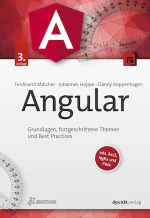

# BookMonkey 4 API


Backend for the [BookMonkey 4](https://github.com/angular-buch/book-monkey4) demo.  
A publicly available server is hosted at [api4.angular-buch.com](http://api4.angular-buch.com).  
The API is fully described via swagger. Explore it [here](http://api4.angular-buch.com/swagger-ui/#/book).


# The book

[](https://angular-buch.com/)

This backend is used to explain HTTP communication with Angular.  
Read more about Angular in our book. Visit [angular-buch.com](https://angular-buch.com/) for more information (German only).


## Install & Start

You might want to extend or modify the project.  
Execute the following commands to start the standalone-server:

```
git clone https://github.com/angular-buch/api4.git
cd api4
npm install
npm start
```

Open __http://localhost:3000/__ in your browser.


## Updating deps

Please take care of the file `package.prod.json`.
Keep it in sync with you development `package.json`.

# License

Code released under the [MIT license](LICENSE).
